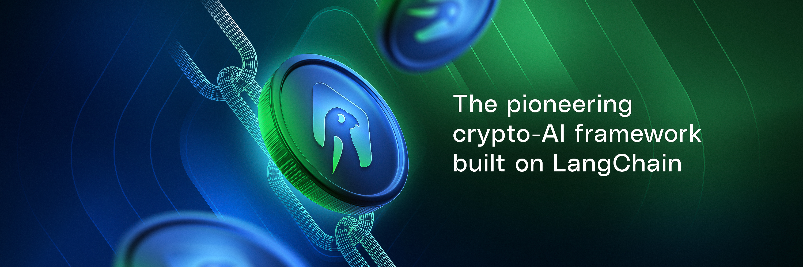

# 🌟 LangAI Client SDK


<div align="center">
  
</div>


[](https://t.me/your_telegram_channel)
[](https://langai.tech)


---

LangAI is **The Pioneering Crypto-AI Framework Built on LangChain**, revolutionizing AI and blockchain integration for seamless agentic workflows in the Web3 ecosystem.

---

## 🌟 **Introduction**

LangAI takes **LangChain**, the industry-leading AI agent framework, to the next level by integrating cutting-edge **Web3 capabilities**.  

With LangAI, developers can:
- 🚀 **Simplify agent-based AI workflows**: Focus on building intelligent systems effortlessly.  
- 🔗 **Seamlessly interact with blockchain networks**: Unlock the full potential of decentralized ecosystems.  
- 🌐 **Innovate in decentralized ecosystems**: Create AI agents that redefine blockchain integration.  

---


## 👁️ Vision & 🤝 Mission

### Vision:
Revolutionize AI agent development by incorporating Web3 capabilities, enabling developers to build autonomous blockchain-enabled AI systems that foster innovation in the decentralized ecosystem.

### Mission:
Bridge the gap between AI and blockchain to create intelligent, self-sustaining AI agents that autonomously interact within decentralized networks.

---

## ✨ Key Features

LangAI empowers developers with robust tools and seamless integrations, enabling powerful Web3 actions and AI workflows:
- **Node.js Support**: Full support for Node.js development.
- **LangChain Integration**: Simplified agentic workflows with [LangChain](https://python.langchain.com/docs/introduction/).
- **Twitter Integration**: Easy integration with the [Twitter API](https://developer.twitter.com/en/docs/twitter-api) to extend agentic workflows.
- **Blockchain & Onchain Actions**:
  - 🔀 **Swap Tokens**: Transfer and trade tokens.
  - 🏷️ **Fetching prices**: Fetch prices of coins.
  - 🚰 **Faucet for Testnet Funds**: Access testnet funds easily.
  - 💼 **Wallet Management**: Fetch wallet details and balances.
  - 💸 **Token Transactions**: Transfer tokens.
  - 🖊️ **Basename Registration**: Register [Basenames](https://www.base.org/names).
  - 🪙 **Token Deployment**:
    - Deploy [ERC-20](https://ethereum.org/en/developers/docs/standards/tokens/erc-20/) tokens.
    - Deploy [ERC-721](https://ethereum.org/en/developers/docs/standards/tokens/erc-721/) tokens and mint NFTs.

  - 🔄 **ETH-WETH Wrapping**: Wrap ETH to WETH on Base.

---

## 🛠️ Prerequisites

Before you begin, ensure you have the following installed on your system:
- **Node.js**: Version 18.x or higher
- **NPM**: Version 8.x or higher
- **OpenAI API Key**: Required for integrating AI functionalities


---
## 🚀 Getting Started
```bash
# Clone the repo
git clone https://github.com/langailabs/langai-client.git

# Navigate to the root of the repo
cd langai-client

# Install project dependencies
npm install

#Step 4: Configure your environment variables in .env.example:

# - After updating the file, rename it to .env
mv .env.example .env

# Run your LangAI Agent
npm run start
```
---
## 🧬 Agent's Character 
```bash
# Navigate to the root of the repo
cd langai-client

# Open .env
nano .env

# choose a personality 
go-to: langai-client/src/personalities

# change personality
Change value at AGENT_PERSONALITY  

example:

AGENT_PERSONALITY="vanilla" //default
or
AGENT_PERSONALITY="memecoiner" //new 

```
---

## 🏗️ Framework Architecture

LangAI’s modular architecture includes:
1. **Data Adapters**: Seamless information flow between systems.
2. **Character Systems**: Customizable agent personalities.
3. **Client Interfaces**: Streamlined handling of message interactions.
4. **Extensible Plugins**: Broad functionality for various use cases.

---

## 📺 Change channel 
```bash
# Navigate to the root of the repo
cd langai-client

# Open .env
nano .env

# set channel value
Change value at AGENT_MODE  

example:

AGENT_MODE="ASK" //default
or
AGENT_MODE="TELEGRAM" //new 

```
---

## 🔥 Abstracted API

The LangAI Client abstracts all interactions to our LangAI API:
- helps developers focus on building agents rather than worrying about Web3 infrastructure.
- API handles calls from the Client to ensure data correctness.


---

## ⚙️ Development Experience

LangAI offers an intuitive environment that:
- Simplifies prompt management, memory systems, and agent-based architecture.
- Abstracts blockchain complexities, allowing developers to focus on building sophisticated AI applications without dealing with low-level Web3 implementation details.


---

## 🧩 Platform Integration

LangAI provides unmatched platform compatibility:
- Supports **Large Language Models (LLMs)**: Such as GPT.
- Integrates with popular platforms like Twitter & Telegram.
- Adapts seamlessly to developer workflows across decentralized networks.

---

## 🤝 Contributing

LangAI thrives on community contributions!  
Check out our [CONTRIBUTING.md](./.github/CONTRIBUTING.md) guide for details on how to get involved.

---

## 🛡️ Security and Bug Reports

Found a bug or security vulnerability?  
Please report it through GitHub [issues](https://github.com/langailabs/langai-client/issues).

---
## License

This project is licensed under Apache-2.0.  
Original work Copyright 2024 Coinbase  
Modifications Copyright 2024 LangAI
