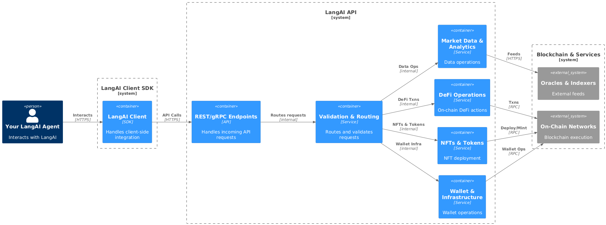

# 🌟 LangAI Client SDK

<div align="center">
  
  <!-- Badges -->
  
  
  
  
  


</div>

<!-- Banner -->

<div align="center">
  
</div>

<div align="center">
  <!-- Repo stats row -->
  <p>
    
    
    
    <a href="https://github.com/langailabs">
      
    </a>
  </p>
  <!-- Community & site row -->
  <p>
    <a href="https://t.me/your_telegram_channel">
      
    </a>
    <a href="https://x.com/langai">
      
    </a>
    <a href="https://langai.tech">
      
    </a>
  </p>
</div>


---

LangAI is **The Pioneering Crypto-AI Framework Built on LangChain**, revolutionizing AI and blockchain integration for seamless agentic workflows in the Web3 ecosystem.


---
<h2 align="center">🌐 Supported Networks</h2>

<p align="center">
  
  


</p>

---

### Try LangAI via GitPod 🤖

[](https://gitpod.io/#https://github.com/sirmojsidev/langaidocs/tree/main)

---

## 🌟 **Introduction**

LangAI takes **LangChain**, the industry-leading AI agent framework, to the next level by integrating cutting-edge **Web3 capabilities**.  

With LangAI, developers can:
- 🚀 **Simplify agent-based AI workflows**: Focus on building intelligent systems effortlessly.  
- 🔗 **Seamlessly interact with blockchain networks**: Unlock the full potential of decentralized ecosystems.  
- 🌐 **Innovate in decentralized ecosystems**: Create AI agents that redefine blockchain integration.  

---

<div align="center">
  <table>
    <tr>
      <td align="center">
        
      </td>
      <td align="center">
        
      </td>
    </tr>
    <tr>
      <td align="left" width="45%">
        <p><strong>Revolutionize AI-agent development</strong> by seamlessly integrating Web3 to empower developers in building autonomous, blockchain-enabled AI systems that ignite innovation across decentralized ecosystems.</p>
      </td>
      <td align="left" width="45%">
        <p><strong>Bridge AI & blockchain</strong> by delivering self-sustaining AI agents that autonomously interact within decentralized networks—unlocking powerful, trustless workflows for tomorrow’s Web3 applications.</p>
      </td>
    </tr>
  </table>
</div>

---


## 🔑 Features

<div align="center">

| **Market Data & Analytics** 📊                     | **DeFi Operations** 🏦                        | **NFT & Digital Assets** 🎨               |
|:-------------------------------------------------:|:---------------------------------------------:|:-----------------------------------------:|
| - **Allora**: Price **predictions** & insights    | - **Compound**: Supply / Borrow / Repay       | - **ERC721**: Mint / Transfer / Balances |
| - **DeFiLlama**: Protocol & price tracking        | - **Moonwell**: Mint & Redeem                | - **OpenSea**: Listings & Portfolio      |
| - **Alchemy**: Symbol & contract lookups          | - **Morpho**: Deposit & Withdrawal           | - **CDP NFT**: Deploy NFT contracts      |
| - **Pyth**: Real-time on-chain feeds              | - **WETH**: Wrap / Unwrap ETH                |                                           |
|                                                   | - **WOW**: Create / Buy / Sell tokens        |                                           |

| **Token Management** 🎟️                           | **Wallet & Infrastructure** 🔧               |
|:-------------------------------------------------:|:---------------------------------------------:|
| - **ERC20**: Transfers & balances                 | - **Wallet**: Native transfers & details     |
| - **CDP Token**: Deploy ERC-20 contracts          | - **CDP API**: Reputation & faucet access    |
| - **Basename**: Register token names on Base      | - **CDP Wallet**: Contract deploy & trading  |
| - **Swap Tokens**: Trade assets across DEXs       | - **CDP Deploy**: Universal contract tools   |

</div>
</div>

## 🛠️ Prerequisites

Before you begin, ensure you have the following installed on your system:
- **Node.js**: Version 18.x or higher
- **NPM**: Version 8.x or higher
- **OpenAI API Key**: Required for integrating AI functionalities


---
## 🚀 Getting Started
```bash
# Clone the repo
git clone https://github.com/langailabs/langai-client.git

# Navigate to the root of the repo
cd langai-client

# Install project dependencies
npm install

#Step 4: Configure your environment variables in .env.example:

# - After updating the file, rename it to .env
mv .env.example .env

# Run your LangAI Agent
npm run start
```
---
## 🧬 Agent's Character 
```bash
# Navigate to the root of the repo
cd langai-client

# Open .env
nano .env

# choose a personality 
go-to: langai-client/src/personalities

# change personality
Change value at AGENT_PERSONALITY  

example:

AGENT_PERSONALITY="vanilla" //default
or
AGENT_PERSONALITY="memecoiner" //new 

```
---

## 🏗️ Framework Architecture

LangAI’s modular architecture includes:
1. **Data Adapters**: Seamless information flow between systems.
2. **Character Systems**: Customizable agent personalities.
3. **Client Interfaces**: Streamlined handling of message interactions.
4. **Extensible Plugins**: Broad functionality for various use cases.

---

## 📺 Change channel 
```bash
# Navigate to the root of the repo
cd langai-client

# Open .env
nano .env

# set channel value
Change value at AGENT_MODE  

example:

AGENT_MODE="ASK" //default
or
AGENT_MODE="TELEGRAM" //new 

```
## 🔥 Abstracted API

The LangAI Client abstracts all interactions to our LangAI API:  
- Helps developers focus on building agents rather than worrying about Web3 infrastructure.  
- API handles calls from the Client to ensure data correctness.

<div align="center">
  <picture>
    <!-- Image for dark mode -->
    <source srcset="./static/LangAI_structure_dark_diagram.png" media="(prefers-color-scheme: dark)">
    <!-- Image for light mode (or fallback) -->
    
  </picture>
</div>

## ⚙️ Development Experience

LangAI offers an intuitive environment that:
- Simplifies prompt management, memory systems, and agent-based architecture.
- Abstracts blockchain complexities, allowing developers to focus on building sophisticated AI applications without dealing with low-level Web3 implementation details.


---

## 🧩 Platform Integration

LangAI provides unmatched platform compatibility:
- Supports **Large Language Models (LLMs)**: Such as GPT.
- Integrates with popular platforms like Twitter, Telegram & Farcaster.
- Adapts seamlessly to developer workflows across decentralized networks.

---


## 📁 Project Structure

```text
langai-client/
├─ 📂 src/
│   ├─ 🤖 agent/           Agent orchestration & flows  
│   ├─ 🌐 api/             External API handlers  
│   ├─ 💬 channels/        Telegram, X, & other adapters  
│   ├─ 🛠️ helpers/         Utility functions  
│   ├─ 🔗 langchain/       LangChain integrations  
│   ├─ 🧠 personalities/   Agent “character” configs  
│   └─ 🔤 types/           TypeScript definitions  
├─ 🧪 scripts/             Helper scripts (e.g. `genMnemonic.ts`)  
├─ ⚙️ config.ts            Core config entrypoint  
├─ 🌱 .env.example         Env-vars template  
└─ 🚫 .gitignore / .prettierignore
```
## Thanks to all Contributors ❤️


<a href="https://github.com/sirmojsidev/langaidocs/graphs/contributors">
  
</a>

---

## 🤝 Contributing

LangAI thrives on community contributions!  
Check out our [CONTRIBUTING.md](./.github/CONTRIBUTING.md) guide for details on how to get involved.

---

## 🛡️ Security and Bug Reports

Found a bug or security vulnerability?  
Please report it through GitHub [issues](https://github.com/langailabs/langai-client/issues).

---
## License

This project is licensed under Apache-2.0.  
Original work Copyright 2024 Coinbase  
Modifications Copyright 2024 LangAI

---

<div align="center">
  
</div>
